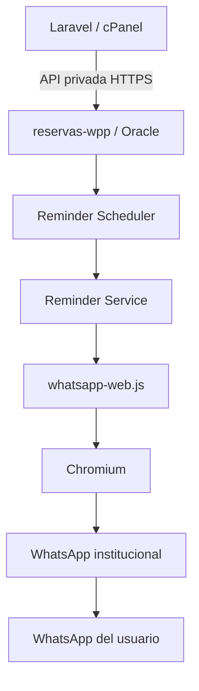

# Arquitectura

## Responsabilidades

### Laravel

- fuente de verdad de las reservas;
- cálculo de `reminder_at` y elegibilidad;
- estados `pending`, `processing`, `sent` y `failed`;
- claim atómico antes del envío;
- confirmación `sent` y registro `failed`;
- reconciliación de estados inciertos.

### Node.js

- consulta periódica de reservas elegibles;
- solicitud del claim;
- normalización de teléfonos;
- formato del mensaje;
- envío mediante WhatsApp institucional;
- reintentos HTTP limitados;
- logs sin datos personales innecesarios.

Node.js nunca accede directamente a la base de datos Laravel.

## Seguridad operacional

`REMINDER_JOB_ENABLED=false` mantiene detenidos WhatsApp y el scheduler. Debe cambiarse a `true` únicamente después de configurar Laravel, Chromium, LocalAuth y el número institucional.

El claim, el envío y la confirmación no forman una transacción distribuida. Si se pierde la respuesta de `claim` o `sent`, Node no marca automáticamente `failed`; Laravel debe reconciliar el registro antes de permitir otro envío.
